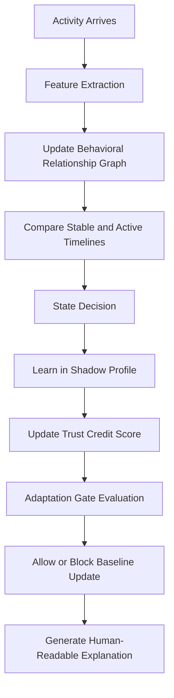

# ShadowTrust

## Adaptive Behavioral Trust for Non-Human Identities

**Learn carefully. Trust selectively. Protect the baseline.**

ShadowTrust is a real-time adaptive behavioral trust system for monitoring and protecting non-human identities (NHIs), including service accounts, API credentials, and workload identities.

It learns how each identity normally behaves, detects sudden and gradual changes, and decides whether new behavior is safe enough to influence the trusted baseline. ShadowTrust is designed to reduce the risk of baseline poisoning while providing clear, human-readable explanations for every decision.

## 1. Team Details

| Field | Details |
| --- | --- |
| **Team Name** | DREAM HACKERS |
| **Team Leader** | M. Lathika |
| **Register Number** | 25TDO458 |
| **College** | Achariya College of Engineering Technology |
| **Domain** | Cyber Security |
| **Problem Statement Code** | PS_02 |
| **Team Members** | M. Lathika, K. Harini, C. Ashika |

## 2. Problem Statement

Non-human identities continuously access applications, services, APIs, and other resources. Their behavior can change for legitimate reasons, such as workload evolution or a new deployment, but a compromised identity may also slowly introduce malicious behavior and poison its baseline.

### Target Users

- Security operations teams
- Cloud and DevOps teams
- Identity and access management administrators
- Organizations operating APIs, microservices, and automated workloads

### Importance

Traditional identity monitoring often relies on static permissions or one-time anomaly detection. This can miss gradual behavioral changes and may allow suspicious activity to become part of the trusted baseline. A system that learns carefully and controls adaptation can reduce false trust, improve incident detection, and limit the impact of compromised non-human identities.

The system must answer two questions:

1. Is this activity consistent with the identity's trusted behavior?
2. If the behavior is new, is it safe to learn and add to the future baseline?

## 3. Proposed Solution

ShadowTrust monitors each non-human identity independently and maintains both trusted long-term behavior and recent activity. New behavior is first learned in an isolated Shadow Profile. A Trust Credit Score, graph relationships, timeline comparison, and an Adaptation Gate are then used to decide whether the trusted baseline may be updated.

This approach solves the problem by separating **behavior detection** from **baseline adaptation**. Repeated activity is not automatically trusted, and suspicious behavior cannot directly poison the stable profile.

### Core Capabilities

- Monitor each non-human identity independently
- Maintain trusted long-term and recent behavioral context
- Detect both sudden anomalies and gradual behavioral drift
- Learn new behavior in an isolated shadow profile
- Assign each identity a dynamic trust credit score
- Prevent suspicious behavior from influencing the trusted baseline
- Visualize identity, resource, and action relationships in real time
- Generate human-readable explanations for trust decisions

## Architecture

ShadowTrust maintains the following components for every non-human identity:

| Component | Purpose |
| --- | --- |
| **Stable Timeline** | Stores long-term trusted behavior. |
| **Active Timeline** | Tracks recent short-term behavior. |
| **Shadow Profile** | Learns new behavior in isolation before it can affect the baseline. |
| **Trust Credit Score** | Represents the identity's dynamic behavioral reputation. |
| **Adaptation Gate** | Makes the final decision about whether behavior can update the trusted baseline. |
| **Behavioral Relationship Graph** | Represents relationships between identities, resources, and actions. |

## 4. Approach / Methodology

ShadowTrust follows a real-time processing pipeline:

### Processing Pipeline

1. **Activity arrives:** Receive a real-time activity event from a non-human identity.
2. **Feature extraction:** Extract resources, action types, sequences, timing, frequency, and other behavioral signals.
3. **Graph update:** Add or update identity, resource, and action nodes and edges in the Behavioral Relationship Graph.
4. **Dual timeline comparison:** Compare recent activity in the Active Timeline with trusted behavior in the Stable Timeline.
5. **State decision:** Classify the current behavior as `NORMAL`, `DRIFTING`, `SUSPICIOUS`, or `HIGH-RISK`.
6. **Shadow learning:** Learn new behavior in the isolated Shadow Profile without immediately changing the trusted baseline.
7. **Trust score update:** Adjust the identity's Trust Credit Score using the latest behavioral and graph signals.
8. **Adaptation gate:** Evaluate whether the new behavior meets the conditions for baseline adaptation.
9. **Final decision:** Allow or block the baseline update.
10. **Explanation:** Produce a human-readable reason for the decision.

## Behavioral Relationship Graph

The Behavioral Relationship Graph models the relationships formed by identity activity:

- **Identity nodes:** Service accounts, API credentials, and workload identities
- **Resource nodes:** APIs, databases, services, files, queues, and other targets
- **Action edges:** The operations performed by identities on resources
- **Behavioral attributes:** Frequency, timing, sequence, first-seen status, and risk signals

The graph helps ShadowTrust:

- Detect unusual access patterns
- Find hidden relationships between identities and resources
- Identify newly created or rarely used access edges
- Estimate the potential blast radius of a compromised identity
- Improve `SUSPICIOUS` and `HIGH-RISK` state decisions

### Example

If a service account suddenly connects to a resource it has never accessed before, ShadowTrust marks the new relationship as unusual. The graph signal is then combined with timeline differences, trust score changes, and other risk indicators before the Adaptation Gate decides whether the behavior can influence the baseline.

## Operational States

| State | Meaning | Baseline Update |
| --- | --- | --- |
| `NORMAL` | Behavior matches the trusted profile. | Allowed |
| `DRIFTING` | Behavior is changing and may represent legitimate evolution. | Allowed only if the Adaptation Gate approves |
| `SUSPICIOUS` | Unusual behavior is combined with meaningful risk signals. | Blocked |
| `HIGH-RISK` | Strong indicators suggest compromise or an active attack. | Blocked |

## Baseline Protection

ShadowTrust separates detection from adaptation. New activity is not automatically trusted just because it repeats.

The system protects the baseline through:

1. **Dual timelines:** Long-term trusted behavior is compared with recent activity.
2. **Shadow learning:** New behavior is isolated before it can become trusted.
3. **Trust credit:** Identity reputation changes dynamically as evidence accumulates.
4. **Adaptation gate:** A final safety check controls all baseline updates.
5. **Graph context:** Relationships and potential blast radius add context to each decision.

## Why ShadowTrust?

ShadowTrust combines behavioral monitoring with controlled adaptation:

- **Dual Timeline** provides both short-term and long-term context.
- **Shadow Profile** isolates learning and limits baseline poisoning.
- **Trust Credit Score** supports evidence-based trust decisions.
- **Adaptation Gate** acts as the final safety layer.
- **Behavioral Relationship Graph** provides visual intelligence and relationship-aware detection.

## 5. Technology / Tools

| Technology / Tool | Purpose |
| --- | --- |
| **Python** | Core processing, feature extraction, scoring, and decision logic |
| **NetworkX** | Build and analyze the Behavioral Relationship Graph |
| **Pandas** | Store, transform, and analyze timeline activity data |
| **Streamlit** | Build the live monitoring dashboard and visual interface |
| **Synthetic NHI activity data** | Simulate normal behavior, drift, suspicious activity, and high-risk events |

## Example Activity Signals

ShadowTrust can analyze signals such as:

- First-time access to a resource
- Changes in action sequence
- Unusual access frequency
- Activity outside the normal time window
- Sudden expansion of resource relationships
- Multiple identities converging on an unexpected resource
- Repeated low-risk changes that gradually alter behavior

## 6. Expected Output / MVP

The minimum viable product will demonstrate:

- A Streamlit dashboard for monitoring multiple non-human identities
- Synthetic real-time activity generation and feature extraction
- Stable Timeline and Active Timeline comparison
- A Shadow Profile that isolates newly observed behavior
- Trust Credit Score calculation and updates
- `NORMAL`, `DRIFTING`, `SUSPICIOUS`, and `HIGH-RISK` state classification
- A NetworkX-based Behavioral Relationship Graph
- Adaptation Gate decisions that allow or block baseline updates
- Human-readable explanations for each decision
- A visual demonstration of a previously unseen resource edge and its effect on risk

### Demonstration Scenario

The team will show a service account operating normally, gradually drifting after a deployment, and then accessing an unusual resource. ShadowTrust will visualize the new graph relationship, classify the behavior, update the shadow profile, and block the stable baseline update when the risk is high.

## 7. Team Roles

| Role | Responsibility | Member |
| --- | --- | --- |
| **Team Leader / Product Coordinator** | Coordinate development, define the demonstration, and present the solution. | M. Lathika |
| **Behavioral Analysis Developer** | Implement timelines, feature extraction, state classification, and trust scoring. | K. Harini |
| **Graph, Dashboard, and Testing Developer** | Build the NetworkX graph, Streamlit interface, synthetic data, and test scenarios. | C. Ashika |

## 8. Feasibility

ShadowTrust is achievable within a hackathon because:

- The system can use synthetic activity data instead of requiring production integrations.
- Python, Pandas, NetworkX, and Streamlit are accessible, well-supported tools.
- The core behavior can be demonstrated with rule-based scoring and lightweight statistical comparisons.
- NetworkX provides the required graph operations without building a graph database.
- Streamlit enables a usable dashboard without a separate frontend stack.
- The MVP has a focused scope: simulate activity, analyze behavior, visualize relationships, and demonstrate controlled baseline updates.

## 9. References / Data Sources

- NIST, *Digital Identity Guidelines*, https://pages.nist.gov/800-63-3/
- NIST, *Cybersecurity Framework 2.0*, https://www.nist.gov/cyberframework
- MITRE ATT&CK, *Valid Accounts*, https://attack.mitre.org/techniques/T1078/
- MITRE ATT&CK, *Account Access Removal*, https://attack.mitre.org/techniques/T1531/
- NetworkX Documentation, https://networkx.org/documentation/stable/
- Streamlit Documentation, https://docs.streamlit.io/
- Pandas Documentation, https://pandas.pydata.org/docs/
- Synthetic activity data generated by the ShadowTrust team for prototype testing

## 10. Project Goals

- Demonstrate adaptive trust for non-human identities
- Make baseline updates deliberate and explainable
- Detect both abrupt compromise and gradual poisoning attempts
- Show how graph relationships improve behavioral risk analysis
- Provide an interactive dashboard suitable for hackathon evaluation
